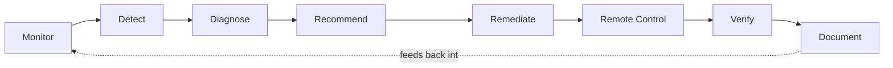
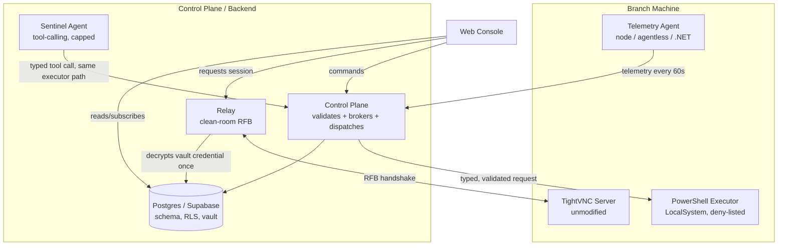

# 01 — Overview

## The problem this replaces

Before this system, supporting a branch meant opening TightVNC Viewer, looking up an IP address in a spreadsheet, dismissing a Caps Lock warning, and typing a shared password that every technician knows — then hoping the machine you land on is actually the one with the problem.

That workflow has four structural gaps:

- **No fleet view** — nothing shows the state of all branches at once.
- **No telemetry history** — nothing shows whether a symptom is new or recurring.
- **No audit trail** — nothing shows who did what, on which machine, or why.
- **No proactive detection** — a branch's trouble isn't visible until someone there picks up the phone.

IT Sentinel replaces the spreadsheet-and-shared-password workflow with a governed system that closes all four gaps at once.

## The loop this system implements

Every part of IT Sentinel exists in service of one loop:

Remote control — the TightVNC-compatible session button — is **one step** in that loop, not the product. The product is a continuously-updated picture of 44+ branches that tells a technician:

- **which** machine is broken,
- **what** is probably wrong,
- **whether it's happened before**, and
- **what fixed it last time** —

then gives them governed tools to act, with everything they do recorded.

## What actually exists right now

| Layer | What it does | Where |
|---|---|---|
| Telemetry collectors | Three interchangeable agents (Node, agentless, and .NET variants) report machine health every 60 seconds | `apps/agent-node`, `apps/agent-less`, `apps/agent-dotnet` |
| Control plane | Validates incoming telemetry, brokers remote sessions, dispatches commands, and enforces policy before anything reaches a machine | `apps/control-plane` |
| Database | Postgres/Supabase — schema, row-level security (RLS), realtime subscriptions, and the credential vault | `packages/db` |
| Web console | Branch sidebar, fleet table, per-machine workspace, voice interface, and the embedded remote viewer | `apps/web` |
| Remote access engine | Clean-room RFB relay — runs in the browser, terminates the VNC handshake server-side so the credential never reaches the browser | `apps/relay` |
| Elevated execution | Constrained, deny-listed, hash-pinned PowerShell execution running as LocalSystem on the branch machine | `apps/agent-node/src/exec` |
| Script library | Signed, hashed playbooks for common fixes, versioned independently of the agents that run them | `packages/scripts` |
| AI assistant | Tool-calling harness with a hard-coded, non-negotiable permission ceiling | `apps/sentinel-agent` |
| Shared contract | The single schema every collector and the control plane agree on, so a telemetry payload means the same thing everywhere | `packages/contracts` |

## Design principles that show up everywhere in the code

**The executor is authoritative, the prompt is not.** Nothing in this system — not the AI assistant, not the terminal UI, not a voice command — executes anything directly. Every action becomes a typed request that a separate executor validates against a compiled deny list before anything runs. This holds twice over: once for the AI agent (`apps/sentinel-agent/src/executor.ts`) and once for elevated shell execution (`apps/agent-node/src/exec/executor.ts`). An instruction that doesn't pass validation doesn't run, regardless of its source.

**Nobody holds the password.** The VNC credential lives in Supabase Vault, encrypted at rest. It is decrypted exactly once, server-side, by the relay, to complete the RFB handshake — and it is never returned to a browser, written to a log, or exposed to the AI agent. See [08-relay-and-remote-access.md](./08-relay-and-remote-access.md) and [05-security-model.md](./05-security-model.md).

**RLS is the backstop, not the only line of defense.** Every table denies access by default. An operator sees exactly what their `site_access` grants permit — proven live with tests, not just asserted, in [12-testing-and-verification.md](./12-testing-and-verification.md).

**Staleness is not health.** A machine that stops reporting flips to a distinct `stale` state within 5 minutes via a `pg_cron` sweep. Silence is treated as a signal, not as "still fine" — a branch never stays green just because nobody's heard from it.

**Nothing here copies TightVNC.** The remote-access engine is a clean-room implementation of RFB 3.8 built from the published RFC — not a fork or adaptation of TightVNC, TigerVNC, RealVNC, or any other VNC vendor's source. TightVNC Server keeps running unmodified on every branch PC as the protocol endpoint; this system only replaces the viewer and the transport in front of it. See [08-relay-and-remote-access.md](./08-relay-and-remote-access.md).

## Who this is for

- **A technician** opens the console, sees which branches are broken, clicks through to a machine, and gets a remote session or a terminal — without ever knowing a password.
- **An IT manager** reads the daily digest, sees cause analytics (e.g., "Enquest sync 31%, printer queues 22%..."), and knows where to focus next.
- **A security or compliance reviewer** reads the audit log and can trace every privileged action back to an operator, a ticket, and the policy decision that allowed it.
- **A developer** extending this system starts at [03-architecture.md](./03-architecture.md), then moves to the specific layer they're touching.